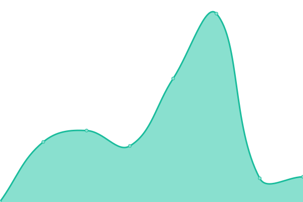
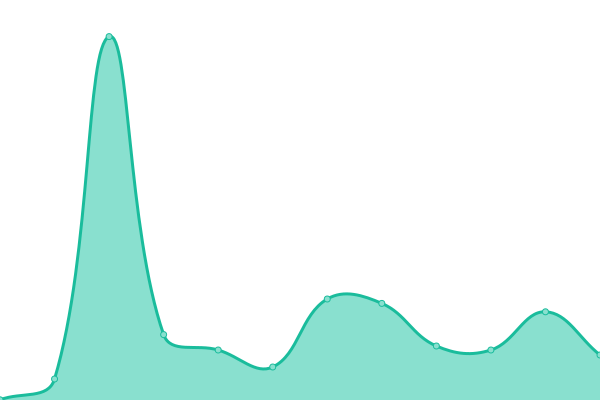
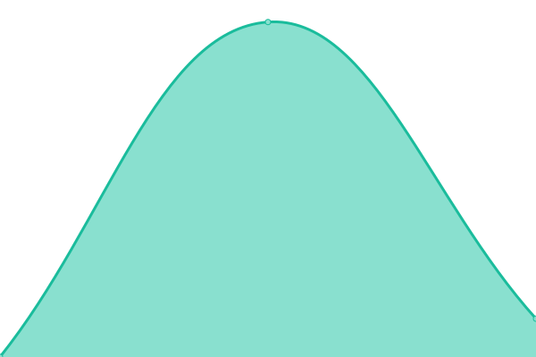

# [📈 Live Status](https://status.powerguilds.foo.ng): <!--live status--> **🟧 Partial outage**

This repository contains the open-source uptime monitor and status page for [Soumalya Ghosh](https://duck.is-a.dev), powered by [Upptime](https://github.com/upptime/upptime).

With [Upptime](https://upptime.js.org), you can get your own unlimited and free uptime monitor and status page, powered entirely by a GitHub repository. We use [Issues](https://github.com/ServerDeveloper9447/statuspage/issues) as incident reports, [Actions](https://github.com/ServerDeveloper9447/statuspage/actions) as uptime monitors, and [Pages](https://status.powerguilds.foo.ng) for the status page.

<!--start: status pages-->
<!-- This summary is generated by Upptime (https://github.com/upptime/upptime) -->
<!-- Do not edit this manually, your changes will be overwritten -->
<!-- prettier-ignore -->
| URL | Status | History | Response Time | Uptime |
| --- | ------ | ------- | ------------- | ------ |
|  [Power Guilds Website](https://powerguilds.foo.ng) | 🟩 Up | [power-guilds-website.yml](https://github.com/ServerDeveloper9447/statuspage/commits/HEAD/history/power-guilds-website.yml) | 

 700ms
     
 | 

<a href="https://status.powerguilds.foo.ng/history/power-guilds-website">100.00%</a>
    

|  Power Guilds Backend (If down but bot still running, it's likely on backup hosting) | 🟥 Down | [power-guilds-backend-if-down-but-bot-still-running-it-s-likely-on-backup-hosting.yml](https://github.com/ServerDeveloper9447/statuspage/commits/HEAD/history/power-guilds-backend-if-down-but-bot-still-running-it-s-likely-on-backup-hosting.yml) | 

 262ms
     
 | 

<a href="https://status.powerguilds.foo.ng/history/power-guilds-backend-if-down-but-bot-still-running-it-s-likely-on-backup-hosting">100.00%</a>
    

|  [Power Guilds Web Dashboard](https://dash.powerguilds.foo.ng) | 🟥 Down | [power-guilds-web-dashboard.yml](https://github.com/ServerDeveloper9447/statuspage/commits/HEAD/history/power-guilds-web-dashboard.yml) | 

 3278ms
     
 | 

<a href="https://status.powerguilds.foo.ng/history/power-guilds-web-dashboard">96.87%</a>
    

|  Power Guilds Web Dashboard (Backend) | 🟥 Down | [power-guilds-web-dashboard-backend.yml](https://github.com/ServerDeveloper9447/statuspage/commits/HEAD/history/power-guilds-web-dashboard-backend.yml) | 

 165ms
     
 | 

<a href="https://status.powerguilds.foo.ng/history/power-guilds-web-dashboard-backend">56.15%</a>
    

|  [Power Guilds Web Dashboard (Backend Domain Proxy Server)](https://internal.powerguilds.foo.ng) | 🟥 Down | [power-guilds-web-dashboard-backend-domain-proxy-server.yml](https://github.com/ServerDeveloper9447/statuspage/commits/HEAD/history/power-guilds-web-dashboard-backend-domain-proxy-server.yml) | 

 0ms
     
 | 

<a href="https://status.powerguilds.foo.ng/history/power-guilds-web-dashboard-backend-domain-proxy-server">100.00%</a>
    

<!--end: status pages-->

[**Visit our status website →**](https://status.powerguilds.foo.ng)

## 📄 License

- Powered by: [Upptime](https://github.com/upptime/upptime)
- Code: [MIT](./LICENSE) © [Anand Chowdhary](https://anandchowdhary.com), supported by [Pabio](https://pabio.com)
- Data in the `./history` directory: [Open Database License](https://opendatacommons.org/licenses/odbl/1-0/)
