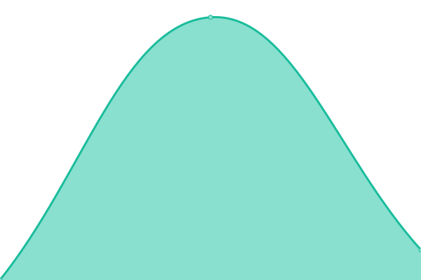

# [📈 Live Status](https://ServerDeveloper9447.github.io/statuspage): <!--live status--> **🟧 Partial outage**

This repository contains the open-source uptime monitor and status page for [Soumalya Ghosh](https://duck.is-a.dev), powered by [Upptime](https://github.com/upptime/upptime).

With [Upptime](https://upptime.js.org), you can get your own unlimited and free uptime monitor and status page, powered entirely by a GitHub repository. We use [Issues](https://github.com/ServerDeveloper9447/statuspage/issues) as incident reports, [Actions](https://github.com/ServerDeveloper9447/statuspage/actions) as uptime monitors, and [Pages](https://ServerDeveloper9447.github.io/statuspage) for the status page.

<!--start: status pages-->
<!-- This summary is generated by Upptime (https://github.com/upptime/upptime) -->
<!-- Do not edit this manually, your changes will be overwritten -->
<!-- prettier-ignore -->
| URL | Status | History | Response Time | Uptime |
| --- | ------ | ------- | ------------- | ------ |
|  [Power Guilds Website](https://powerguilds.foo.ng) | 🟩 Up | [power-guilds-website.yml](https://github.com/ServerDeveloper9447/statuspage/commits/HEAD/history/power-guilds-website.yml) | 

 360ms
     
 | 

<a href="https://status.powerguilds.foo.ng/history/power-guilds-website">100.00%</a>
    

|  Power Guilds Backend (node 1) | 🟥 Down | [power-guilds-backend-node-1.yml](https://github.com/ServerDeveloper9447/statuspage/commits/HEAD/history/power-guilds-backend-node-1.yml) | 

 0ms
     
 | 

<a href="https://status.powerguilds.foo.ng/history/power-guilds-backend-node-1">0.00%</a>
    

|  Power Guilds Backend (node 2) | 🟥 Down | [power-guilds-backend-node-2.yml](https://github.com/ServerDeveloper9447/statuspage/commits/HEAD/history/power-guilds-backend-node-2.yml) | 

 0ms
     
 | 

<a href="https://status.powerguilds.foo.ng/history/power-guilds-backend-node-2">0.00%</a>
    

|  Image Generation Service | 🟥 Down | [image-generation-service.yml](https://github.com/ServerDeveloper9447/statuspage/commits/HEAD/history/image-generation-service.yml) | 

 0ms
     
 | 

<a href="https://status.powerguilds.foo.ng/history/image-generation-service">0.00%</a>
    

|  [Power Guilds Web Dashboard](https://dash.powerguilds.foo.ng) | 🟥 Down | [power-guilds-web-dashboard.yml](https://github.com/ServerDeveloper9447/statuspage/commits/HEAD/history/power-guilds-web-dashboard.yml) | 

 0ms
     
 | 

<a href="https://status.powerguilds.foo.ng/history/power-guilds-web-dashboard">0.00%</a>
    

|  [Power Guilds Web Dashboard (Backend)](https://internal.powerguilds.foo.ng) | 🟥 Down | [power-guilds-web-dashboard-backend.yml](https://github.com/ServerDeveloper9447/statuspage/commits/HEAD/history/power-guilds-web-dashboard-backend.yml) | 

 0ms
     
 | 

<a href="https://status.powerguilds.foo.ng/history/power-guilds-web-dashboard-backend">0.00%</a>
    

<!--end: status pages-->

[**Visit our status website →**](https://ServerDeveloper9447.github.io/statuspage)

## 📄 License

- Powered by: [Upptime](https://github.com/upptime/upptime)
- Code: [MIT](./LICENSE) © [Anand Chowdhary](https://anandchowdhary.com), supported by [Pabio](https://pabio.com)
- Data in the `./history` directory: [Open Database License](https://opendatacommons.org/licenses/odbl/1-0/)
